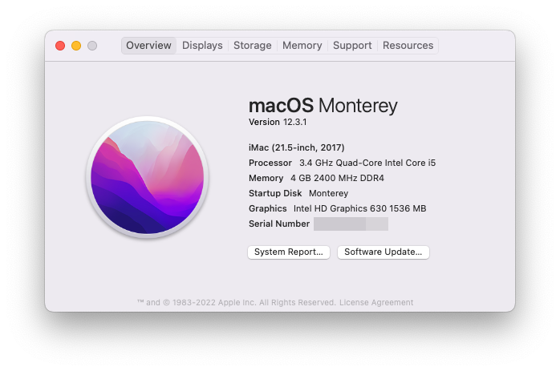

# HP-290-G1-MiniTower - Hackingtosh
This repo contains Opencore EFI files and scripts to Install macOS

 

## Bootloader
- Opencore 0.7.9

# Specifications

### Basic
- Model : **`HP`**
- BIOS Ver: **``**

### Hardware

- CPU: Intel® Core i5-7500 @ 3.40 GHz processor (4 Cores)
- GPU: Integrated Intel® HD Graphics 630 (1 HDMI + 1 VGA Port)
- Memory: 1 x 4GB Micron DDR4-2400
- Storage: Segate 500 GB (7200 RPM) 
- LAN: Intel® I219M Gigabit Network Connection LOM
- WLAN: TPLink TP752N 
- Audio: Realtec ALC221 Audio Codec (all ports are stereo, 1 internal speaker)

### Tested OS
- Bigsur 11.2.3
- Monterey 12.3.1 
> had a issue black screen issue with booting the installer - but adding device-id to the iGPU solved it.
